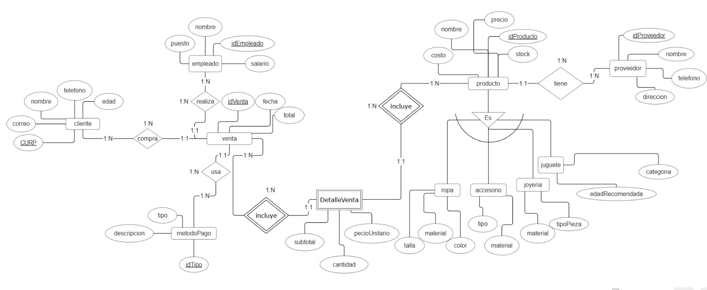
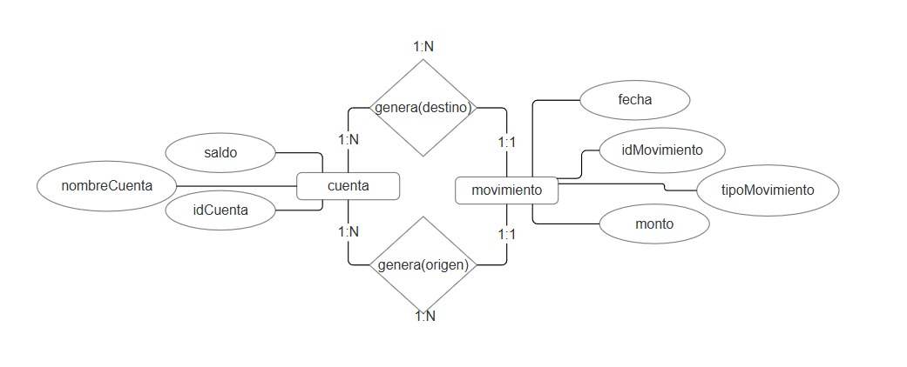
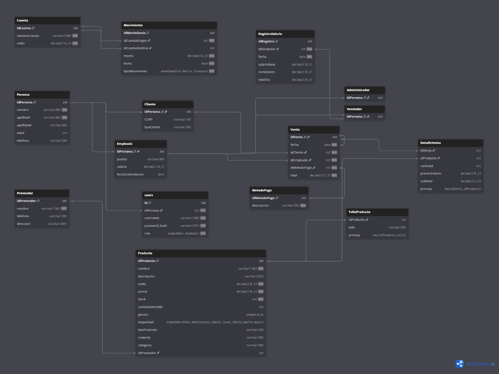

# 🛒 Sistema de Gestión de Ventas e Inventario (Refactorizado)

Este proyecto es una aplicación web completa para la administración de un comercio, que incluye gestión de inventario, registro de ventas, cálculo de comisiones y nómina de empleados.

El sistema ha pasado por un proceso de **modernización total**, migrando de PHP nativo estructurado a una **Arquitectura MVC** utilizando **Eloquent ORM**.

## 🔗 Demo en Vivo

Puedes acceder al proyecto funcional aquí:
👉 **[http://www.proyectobdluis.rf.gd/](http://www.proyectobdluis.rf.gd/)**

> **Credenciales de prueba:**
> * **Usuario: admin o vendedor1
> * **Contraseña: temp

---

## 🛠️ Tecnologías y Técnicas Implementadas

Este proyecto destaca por la transición de código heredado a estándares modernos de desarrollo PHP:

### 1. Arquitectura MVC (Modelo-Vista-Controlador)
Se separó la lógica de negocio de la interfaz de usuario para mejorar la mantenibilidad y escalabilidad.
- **Modelos (`/models`):** Representación de datos usando Eloquent.
- **Controladores (`/controllers`):** Lógica de negocio (Ventas, Productos) centralizada.
- **Vistas (`/admin`, `/vendedor`):** Interfaz limpia separada de las consultas SQL.

### 2. Implementación de Eloquent ORM
Se eliminaron las consultas SQL manuales (`SELECT`, `INSERT`, `JOIN`) y se reemplazaron por objetos PHP, permitiendo:
- **Relaciones limpias:** Uso de `hasMany` y `belongsTo` para conectar Productos, Proveedores y Ventas sin escribir `JOINs` complejos.
- **Seguridad:** Protección automática contra Inyección SQL.
- **Transacciones de Base de Datos:** Uso de `DB::beginTransaction()` para asegurar la integridad de datos críticos (Stock + Venta + Salario + Caja) en una sola operación atómica.

### 3. Gestión de Dependencias
- Uso de **Composer** para la gestión de librerías.
- Carga automática de clases (Autoloading PSR-4), eliminando los `include` manuales repetitivos.

### 4. Seguridad
- Encriptación de contraseñas utilizando `password_hash` y verificación con `password_verify`.
- Validación de sesiones y roles (Admin vs. Vendedor).

---

## 📊 Diagrama Entidad-Relación (ER)

La base de datos relacional está diseñada para mantener la integridad referencial entre las operaciones comerciales.




*(Nota: Debes subir una imagen llamada `imagen_diagrama.png` o similar a tu repo y cambiar esta ruta)*

**Entidades Principales:**
* **Venta & DetalleVenta:** Cabecera y renglones de cada transacción.
* **Producto:** Inventario, costos y precios.
* **Persona/Usuario:** Gestión de identidad y roles.
* **RegistroSalario:** Cálculo automático de comisiones basado en ventas diarias.
* **Proveedor & Cliente:** Entidades externas relacionadas.

---

## 📂 Estructura del Proyecto

```text
/
├── admin/          # Panel de Control (Vistas del Administrador)
├── vendedor/       # Panel de Ventas (Vistas del Vendedor)
├── config/         # Configuración de base de datos (Eloquent)
├── controllers/    # Lógica de Negocio (ProductoController, VentaController)
├── models/         # Modelos de Datos (Producto, Venta, User...)
├── vendor/         # Dependencias de Composer
├── index.php       # Login y Punto de Entrada
└── style.css       # Estilos Globales
